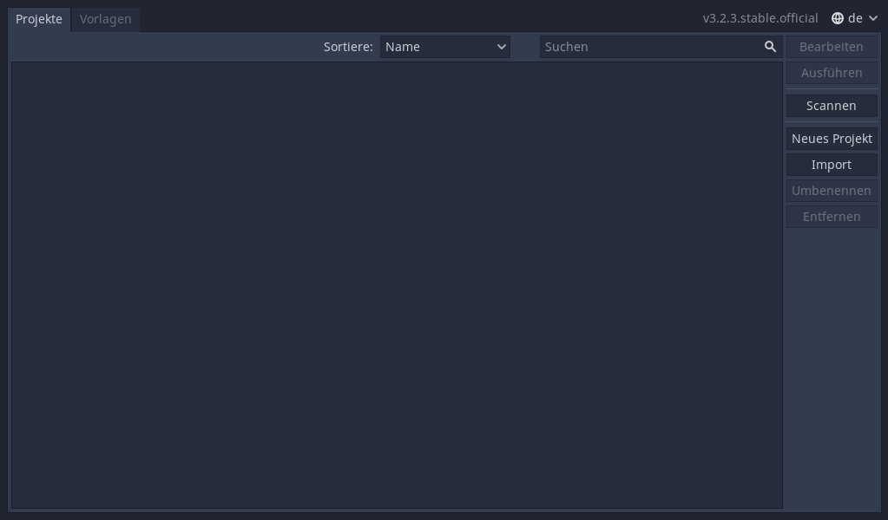
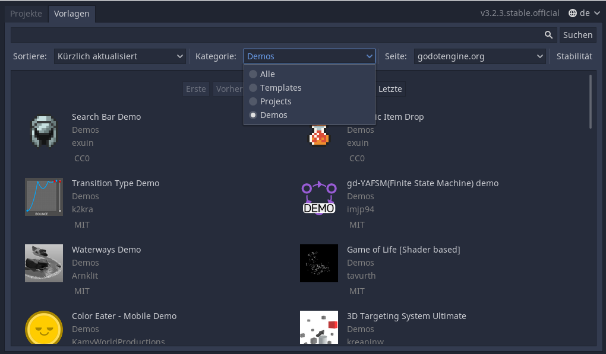
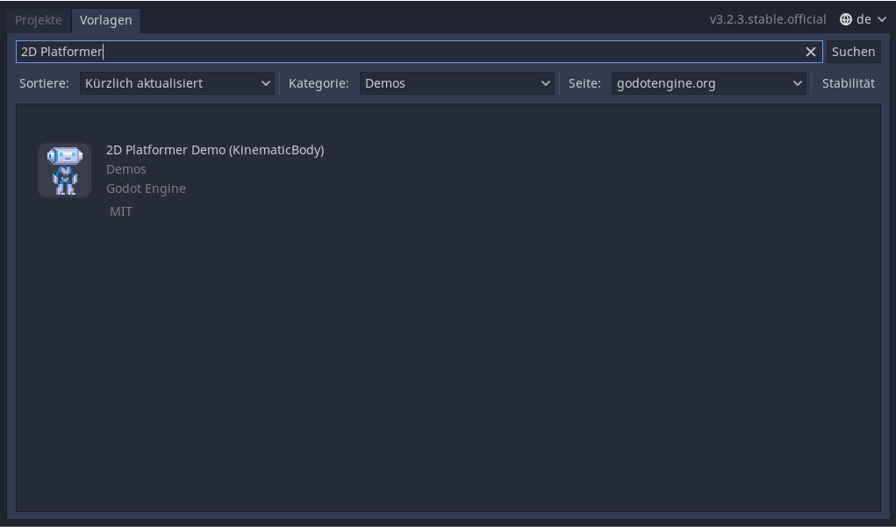
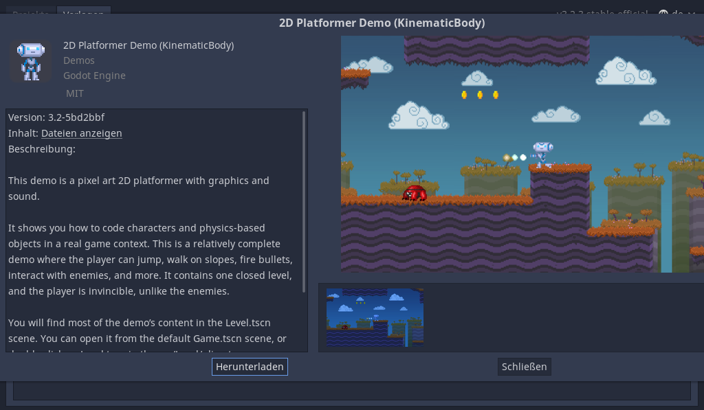
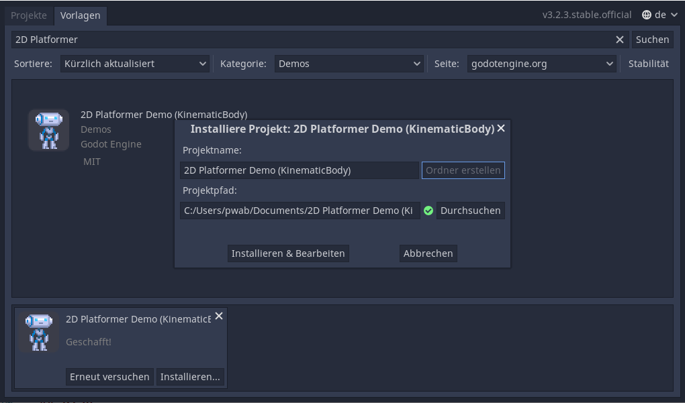
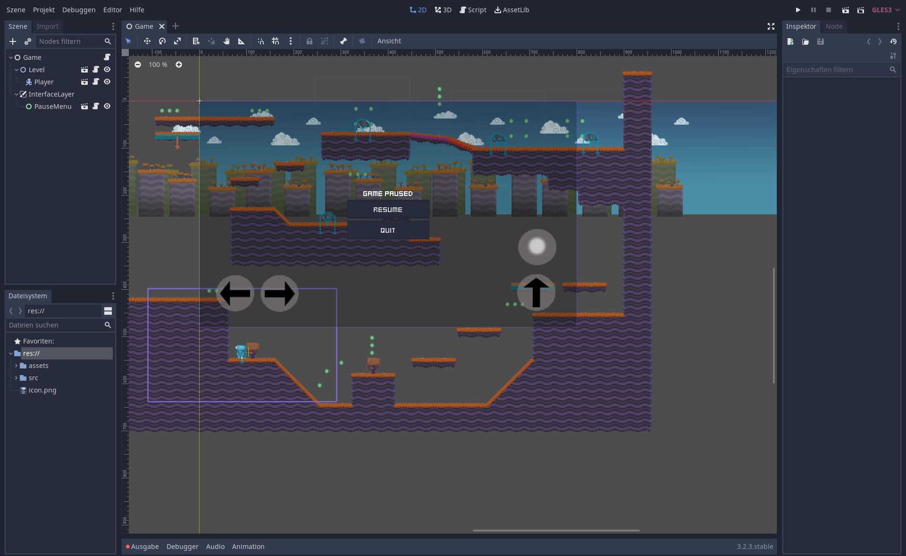

# Ein Spiel starten

Dann legen wir mal los. Startet die Godot Engine. Ihr solltet nach einer kurzen Ladezeit folgendes Fenster sehen:

Dies ist die _Projektverwaltung_. Diese ist zu Beginn natürlich noch leer. Aber das heißt nicht, dass man sie nicht schnell füllen kann. Gerade am Anfang habe ich viele kleine Testprojekte erstellt - ich habe bestimmt schon hundert Stück davon in meiner Liste. Aber man kann auch auf andere Weise die ersten Erfahrungen machen: mit den Demos.

!!! info "Spracheinstellung"
    Falls die Projektverwaltung auf Englisch angezeigt ist, könnt ihr sie - und damit das gesamte Programm - oben rechts auf Deutsch umstellen. Das hilft teilweise am Anfang überall die richtigen Einstellungen zu finden, aber wenn ihr mal online nach Hilfe fragt, werdet ihr immer die Englischen Begriffe finden. Ein Umstellen ist auch jederzeit in den Programmeinstellungen möglich.

## Vorlagen und Demos

Eine gängige Herangehensweise als Anfänger in der Spieleprogrammierung ist das Lernen an Beispielen. Bei Godot findet man dazu offizielle Demos, welche verschiedene Themen in möglichst kompakten Projekten zeigen. Manchmal gibt es dazu etwas wenig Erklärung, aber da muss man einfach Rumprobieren und die Dokumentation lesen. Und wenn alles nichts hilft, dann kann man immer irgendwo um Hilfe bitten.

## Demo herunterladen und installieren

Klick in der Projektverwaltung auf den Reiter `Vorlagen`:

Dort sortierst du nach den `Demos`:

Jetzt nimmst du am besten die `2D Platformer`. Gebt dazu den Namen einfach in das Feld ein:

Klick nun auf die Demo, dann auf `Herunterladen` und anschließend auf `Installieren`:

Du musst einen leeren Ordner finden, in dem ihr die Dateien ablegen wollt. Unter Umständen musst du diesen neu anlegen. Am Ende sollte es in der Projektverwaltung wie im folgenden Bild aussehen. Achte dabei auf den grünen Haken, der taucht nur auf, wenn der Pfad auf einen leeren Ordner zeigt:

Nun klickst du auf den Button `Installieren und Bearbeiten` und der Editor öffnet sich mit der Demo.

## Play und Stop

Das Schöne an einer Demo ist, dass du jetzt nicht mehr viel tun musst. Klicke einfach oben rechts auf den kleinen Play-Button und das Spiel sollte sich starten und du kannst sofort losspielen.

In der ausgewählten Demo kann man mit den Pfeiltasten herumlaufen, mit der Leertaste springen und mit STRG kannst du kleine Kugeln abfeuern.

Das Spiel lässt sich mit einem Klick auf das Schließen-Kreuz beenden oder durch den Stop-Button im Editor:

Und das war es schon. Damit hast du in kurzer Zeit dein erstes Spiel gestartet und konntest testen, ob die Godot Engine bei dir grundsätzlich funktioniert.