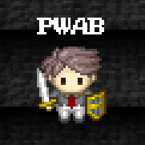

# Spieleprogrammierung mit der Godot Eninge - Ein Workshop bei den Chemnitzer Linux Tagens

## Intro

!!! info "Ein freundliches Hallo"
	Herzlich willkommen!
	
	Diese Seite dient der Begleitung von Workshops zum Thema Godot. Du kannst sie aber auch ohne Workshop durcharbeiten.
	Ich wünsche dir jedenfalls viel Spaß bei der Lektüre. Hier und da fehlt sicherlich noch etwas, aber lass dich davon nicht aufhalten. Bei Fragen erstell einfach bei GitHub einen [Diskussionsbeitrag](https://github.com/pwab/godot-clt2021/discussions)!
	
	*Grüße 
	\- Philipp*
	
	

Godot ist eine freie Spiel-Engine mit der sich auf einfache Weise Ideen für Spiele und Apps auf PC, Smartphone oder im Webbrowser umsetzen lassen. Der Einstieg ist kinderleicht und viele Sachen sind überraschend schnell gemacht. Im Workshop wird ein kleines 2D-Spiel für PC und Smartphone entwickelt, welches im Anschluss beliebig angepasst und verändert werden kann. Unter Anleitung wird jedes Element Schritt für Schritt eingebaut und Fallstricke dabei erklärt. Am Ende des Workshops sollst du gesehen haben, wie die Godot Engine aufgebaut ist und wie man damit die einzelnen Grundbausteine eines Spiels nach und nach zusammenfügt. Mithilfe der umfangreichen Dokumentation können dann selbstständig weitere Themen erarbeitet werden.

## Voraussetzungen

Der Workshop ist konzipiert für Jugendliche ab der 8. Klasse. Programmierkenntnisse sind nicht notwendig, da im Laufe des Workshops alle Codeteile gezeigt und erläutert werden. Der Kurs wird auf Deutsch gehalten, der Code wird allerdings auf Englisch geschrieben, da dies im Programmierbereich üblich ist. Dafür sind jedoch nur grundlegende Sprachkenntnisse notwendig und alle Programmteile werden beim Einfügen auf Deutsch erklärt.

Eine Teilnahme ist auch für andere Personengruppen (bspw. jüngere Kinder unter Begleitung eines Erwachsenen oder ältere/erfahrenere Jugendliche) möglich. Allerdings kann hier nicht auf die speziellen Bedürfnisse (bspw. Über- oder Unterforderung) eingegangen werden - ich werde dennoch mein Bestes versuchen.

Die Software ist für alle gängigen Betriebssysteme verfügbar und dank einer Größe von knapp 70 MB schnell heruntergeladen. Eine Installation wird in der Regel nicht benötigt. Für die Teilnahme am Workshop wird ein PC mit Maus und Tastatur empfohlen, welcher OpenGL 2.1 / OpenGL ES 2.0 kompatible Hardware besitzt - das unterstützen heutzutage aber nahezu alle Rechner also keine Sorge. Zur Not gibt es auch einen [Webeditor](https://editor.godotengine.org/releases/latest/), welcher auf Tablets funktionieren könnte.

Zur Kommunikation wird es während des Workshops einen Textchat geben. Wer ein Mikrofon hat, kann auch dieses für das Stellen von Fragen nutzen. Eine Kamera wird nicht benötigt.

Sollte etwas schieflaufen: Keine Panik! Ich werde noch Texte/Videos erstellen, damit du die Sachen aus dem Workshop nochmal anschauen oder nachlesen kannst.

## Vorbereitung

Ihr braucht für den Workshop:

- [x] einen Computer mit Maus/Mauspad und Tastatur
- [x] ein Headset mit Kopfhörern und am besten mit Mikrofon
- [x] einen 'aufgeräumten' Desktop, der nur Dinge zeigt, die öffentlich sichtbar sein dürfen, da wir eventuell den Bildschirm teilen, um einander zu helfen
- [ ] [die Godot Engine auf eurem PC](level1/installation.md)

## Weiterführende Links

- [Webseite der Chemnitzer Linux-Tage 2021](https://chemnitzer.linux-tage.de/2021/de)
- [Offizielle Webseite der Godot Engine (Englisch)](https://godotengine.org/)

## Lizenz

Der gesamte Workshopinhalt (Text, Bilder und Code) steht unter der [CC0-1.0](https://creativecommons.org/share-your-work/public-domain/cc0/) Lizenz. Er ist also frei nutzbar, kann ohne zu fragen kopiert, verändert und weitergegeben werden.

Eine Ausnahme bilden Screenshots, welche teilweise aus der offiziellen Dokumentation übernommen wurden (extra gekennzeichnet). Sie stehen - genauso wie das Godot Engine Logo - unter der [CC-BY-3.0](https://creativecommons.org/licenses/by/3.0/) Lizenz und wurden erstellt von _Juan Linietsky, Ariel Manzur and the Godot community_.