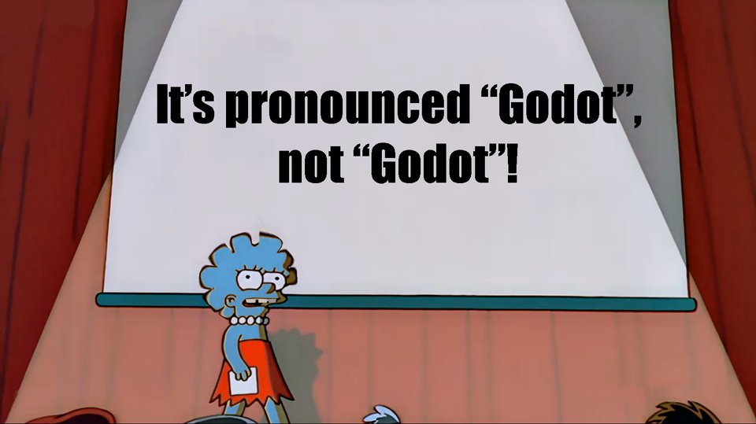

# Aussprache

!!! quote "Zitat von einfach jedem"

    _Ähm wie spricht man "Godot" eigentlich aus?_

Diese Frage habe ich schon sehr oft gehört oder gelesen. Insbesondere unter YouTubevideos findet man öfter heiße Diskussionen darüber. Die Antwort ist einfacher als man denkt: Es ist deine Sache, wie du "Godot" aussprichst! Es ist eine freie und offene Spieleengine und du kannst entscheiden, was du damit machst. Somit kannst du auch entscheiden, wie du es aussprechen willst. Das hat Juan Linietsky - auch _reduz_ genannt - einmal in einem Interview klargestellt. Und er ist neben Ariel Manzur der Begründer und Hauptentwickler von Godot.

Drei Beispiele, wie man es aussprechen kann:

- [GOH-DOH](../assets/godoh.m4a) ... Diese Variante wird am häufigsten verwendet und entspricht der französischen Aussprache. Sie wurde vor allem durch _Nathan_ von [GDQuest](https://www.gdquest.com/) - ein bekannter Godot-YouTuber - verbreitet.
- [GO-DOTT](../assets/godot.m4a) ... Diese Variante mit dem betonten T am Ende entspricht der Aussprache von [_reduz_](https://twitter.com/reduzio), welcher in Argentinien lebt.
- [JO-DOU](../assets/jodou.m4a) ... Das G zu Beginn ausgesprochen wie der Name Joe und der Rest wie das englische Dough (wie in Donut). 

Mach dir also keine Gedanken darüber. Sprich es aus wie du denkst 🤷‍♂️. Frei nach dem Motto:

(Bildquelle: u/meloonicscorp, 11.11.2020, https://www.reddit.com/r/godot/comments/jsc8qm/for_the_last_time/)