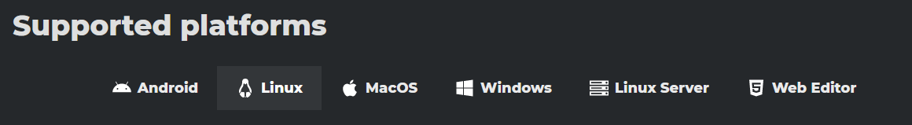
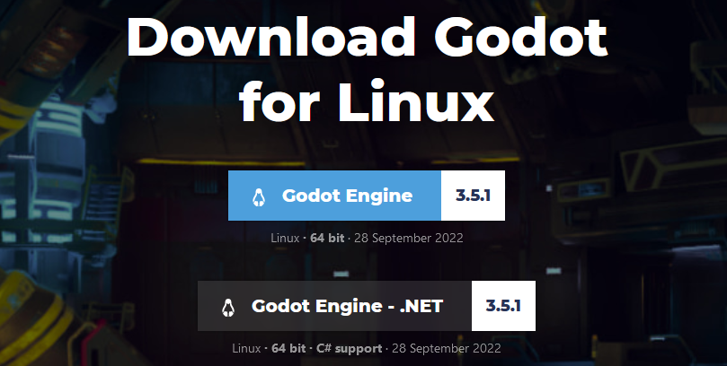
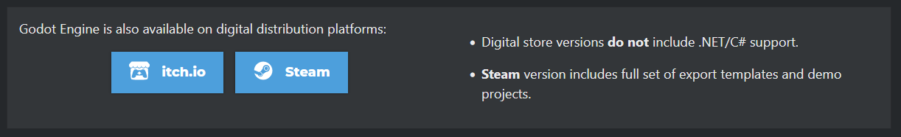

# Installation

Die Godot Engine kannst du auf allen gängigen Betriebssystemen (Linux, Windows, macOS) verwenden. Eine Installation oder Administratorrechte sind in der Regel nicht nötig. Für den Workshop nutzen wir die aktuelle Version von Godot 4 - das ist zum Zeitpunkt der Chemniter Linux-Tage die Version 4.x.x (RC).

!!! question "Moment mal - Ist Godot 4 denn schon fertig!? :thinking:"

    Es stimmt, dass für Godot erst vor kurzem die Version 4 erschienen ist. Das ist die neuste Major-Version und diese bringt sehr viele Neuerungen - vom Vulkan-Renderer bis hin zu GDScript 2.0 - mit sich. Allerdings ist diese Version noch nicht wirklich stabil. Die Erfahrung mit Godot 3.0 hat gezeigt, dass die Engine mindestens ein bis zwei Minor-Versionen benötigt, damit alle krassen Bugs und Probleme behoben sind. Das liegt einfach daran, weil mit einer neuen Major-Version plötzlich sehr viel mehr Leute mit unterschiedlichster Hardware und Ideen im Kopf die Engine ausprobieren. Dabei fallen dann erst die vielen kleinen und großen Probleme auf, die vorher dem Entwicklerteam nicht in dem Maße bekannt waren.

    Grundsätzlich macht man nichts falsch, die Version 3.x weiterhin zu verwenden. Diese wird auch weiter von den Entwicklern gepflegt und bekommt Updates. Man muss auch nicht viel umlernen, wenn man später von Version 3 auf Version 4 wechselt. Der Code wird nahezu gleich aussehen und ein Godot-3-Projekt wird automatisch konvertiert, wenn man es mit Godot 4 öffnet. Dies hat damals beim Wechsel von Godot 2 auf Godot 3 auch schon gut geklappt.

    Dennoch musste ich letztendlich für den Workshop eine Entscheidung treffen. Und den Kurs für Godot 3 zu schreiben, obwohl Godot 4 bereits in der Beta ist, erschien mir wenig sinnvoll. Die Gefahr besteht natürlich, dass das Programm dann bei dem einen oder anderen nicht richtig läuft oder während des Workshops abstürzt. Aber ich hoffe, dass das nur selten der Fall sein wird und wir somit gleich mit dem neusten Godot loslegen können.

## Download über die offizielle Webseite

### Plattformauswahl

Gehe auf die [offizielle Downloadseite](https://godotengine.org/download). Diese wählt automatisch die passende Plattform - also den Download für dein Betriebssystem aus und leitet dich auf die richtige Webseite weiter.

### Varianten

Von der Godot Engine gibt es zwei Varianten: mit und ohne .NET-Unterstützung. Der Unterschied ist, dass die .NET-Variante zusätzlich die Programmiersprache C# unterstützt. Das benötigen wir für den Kurs nicht. Später kann man problemlos zur Mono-Version wechseln, wenn man das mal ausprobieren möchte.

Wenn du mit einem 32-bit Betriebssystem arbeitest, nimm die 32-bit Version. Ansonsten kannst du problemlos die 64-bit Version verwenden - einen Unterschied gibt es meines Wissens nach nicht.

### Download

Klick auf den oberen blauen Button - also den Downloadbutton für die Godot Engine ohne .NET-Unterstützung. Der Download sollte nun starten.

### Keine Installation nötig

Eine Installation ist nicht notwendig, da die Godot Engine einfach so gestartet werden kann (das nennt man portable oder self-contained). Unter Linux muss eventuell noch das Recht zur Ausführung als Applikation gesetzt werden.

Du solltest den Editor nun mit einem Doppelklick starten können und es sollte nach einer kurzen Ladezeit der Godot Splashscreen erscheinen. 👍

## Installation über andere Wege

Die Installation über einen Linux-Paketmanager, Snap oder Flatpack sollte auch funktionieren. Schau dir aber bitte die angebotene Version an, denn viele Pakete sind nicht gepflegt und dementsprechend veraltet. Eine Übersicht für verfügbare Linuxpakete findet sich bei [pkgs.org](https://pkgs.org/search/?q=godot).

Godot kann auch über Drittanbieter bezogen werden. Dazu zählen aktuell Steam und itch.io. Manchmal gibt es hierbei Einschränkungen oder ein paar Sachen sind anders, aber im Großen und Ganzen unterscheiden sich diese Versionen nicht von der, welche auf der offiziellen Webseite heruntergeladen werden kann.

## Webversion

Falls es für dein System keine aktuelle Godot-Version gibt oder sich das Programm nicht starten lässt, dann versuche es mal mit dem Web-Editor. Mit dem habe ich persönlich nur wenig Erfahrungen gemacht, er soll aber dieselben Funktionen unterstützen und eine Bearbeitung von Godot Projekten auch mobil ermöglichen.

Hier ist der Link: [https://editor.godotengine.org/](https://editor.godotengine.org/)