# Eine Demo starten

Für einen ersten Test, können wir mal eine Demo ausprobieren. Das sind fertige Miniprojekte, welche andere Leute erstellt und online zur Verfügung gestellt haben, damit man Sachen einfach mal ausprobieren kann.

Starte dazu die Godot Engine. Du solltest nach einer kurzen Ladezeit folgendes Fenster sehen:

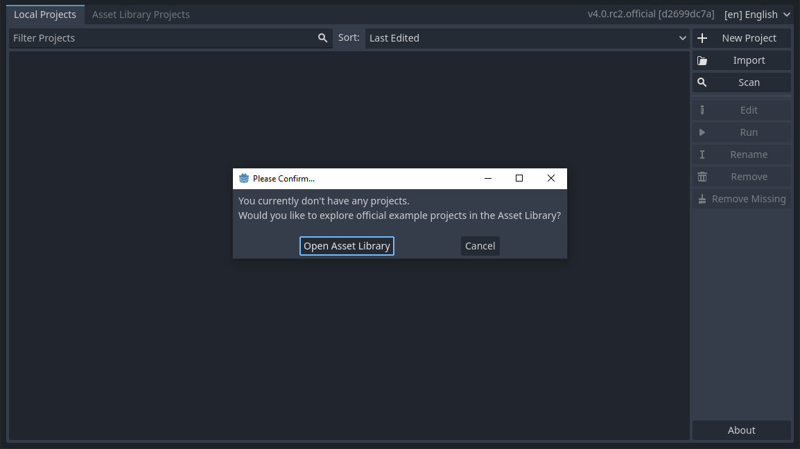

Dies ist die _Projektverwaltung_. Diese ist zu Beginn natürlich noch leer. Aber das heißt nicht, dass man sie nicht schnell füllen kann. Gerade am Anfang habe ich viele kleine Testprojekte erstellt - ich habe bestimmt schon hundert Stück davon in meiner Liste. Aber man kann auch auf andere Weise die ersten Erfahrungen machen: mit den Demos.

!!! tip "Spracheinstellung"
    Falls die Projektverwaltung auf Englisch angezeigt ist, kannst du sie - und damit das gesamte Programm - oben rechts auf Deutsch umstellen. Das hilft teilweise am Anfang überall die richtigen Einstellungen zu finden, aber wenn du mal online nach Hilfe fragst, wirst du immer die englischen Begriffe finden. Ein Umstellen ist auch jederzeit in den Programmeinstellungen möglich.

## Vorlagen und Demos

Eine gängige Herangehensweise als Anfänger in der Spieleprogrammierung ist das Lernen an Beispielen. Bei Godot findet man dazu offizielle Demos, welche verschiedene Themen in möglichst kompakten Projekten zeigen. Manchmal gibt es dazu etwas wenig Erklärung, aber da muss man einfach Rumprobieren und die Dokumentation lesen. Und wenn alles nichts hilft, dann kann man immer irgendwo um Hilfe bitten.

## Demo herunterladen und installieren

Klick in der Projektverwaltung in der Meldung auf `Open Asset Library` - oder wenn du zuvor auf `Cancel` geklickt hast - auf den Reiter `Asset Library Projects`.

Dort siehst du erstmal nichts.

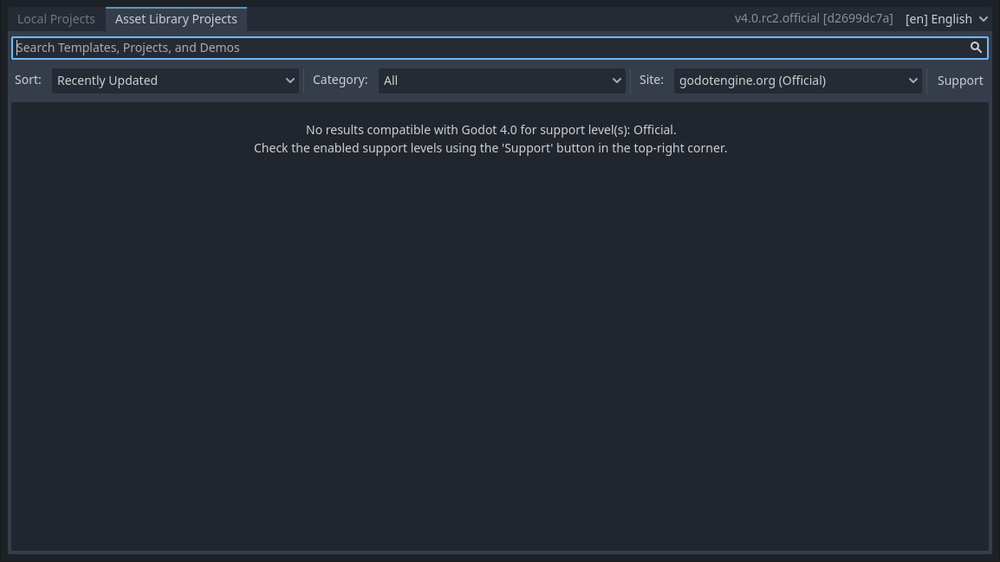

Klicke im Filtermenü am rechten Fensterrand auf `Support` und wähle alle Haken an.

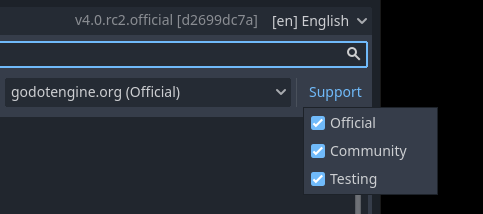

Nun sollten mehrere Projekte, Templates und Demos angezeigt werden. Scrolle ein wenig, bis du das Template `Strafer` entdeckst.

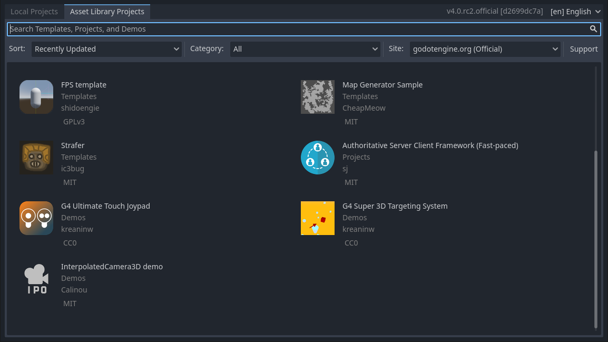

Klicke auf das Symbol bzw. den Namen und es sollte die Beschreibungsseite des Projekts angezeigt werden. Klicke dort auf den Button `Download`.

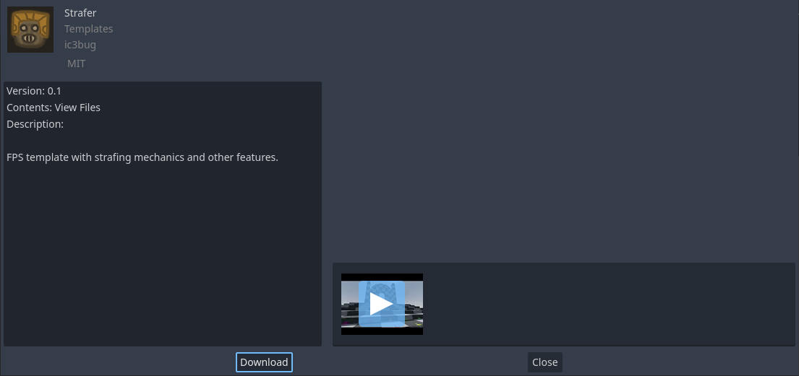

Die Demo wird nun heruntergeladen und muss lokal auf deinem Rechner abgelegt werden. Dazu musst du einen leeren Ordner finden, in welchen du die Dateien ablegen willst (Dies wird über eine gelbe Meldung angezeigt).

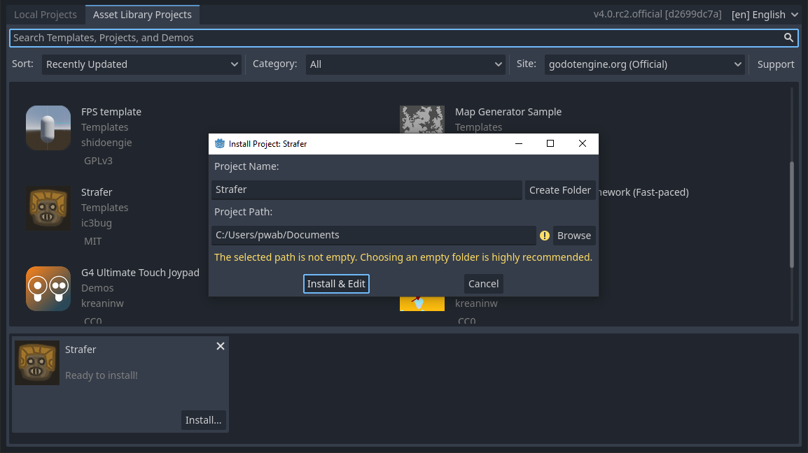

Da du im Laufe der Zeit bestimmt meherere Projekte anlegen wirst, empfehle ich dir, an dieser Stelle einen extra Ordner für Godot anzulegen. Klicke dazu auf `Browse`. Anschließend kannst du im Dateimanager einen Ordner mittels `Create Folder` anlegen. Vergib einen Namen für dein übergeordnetes Verzeichnis (im Beispiel `Godot`) und klicke OK. Anschließend kannst du den Dialog schließen mit einem Klick auf `Select Current Folder`.

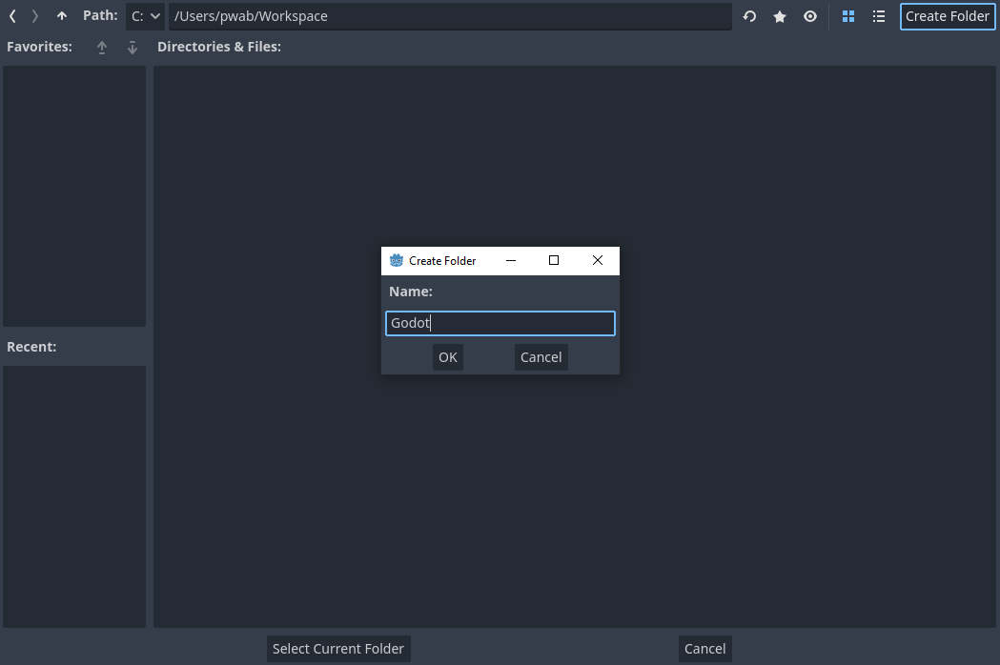

Nun klickst du im Fenster neben dem Projektnamen `Strafer` auf `Create Folder`. Damit erzeugst du einen eigenen Unterordner `Strafer` im Ordner `Godot`. Am Ende sollte es in der Projektverwaltung wie im folgenden Bild aussehen. Achte dabei auf den grünen Haken, der taucht nur auf, wenn der Pfad auf einen leeren Ordner zeigt.

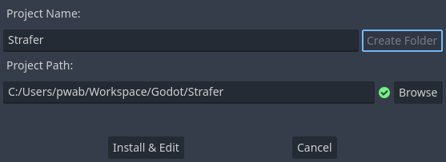

Nun klickst du auf den Button `Install & Edit` und der Editor öffnet sich mit der Demo.

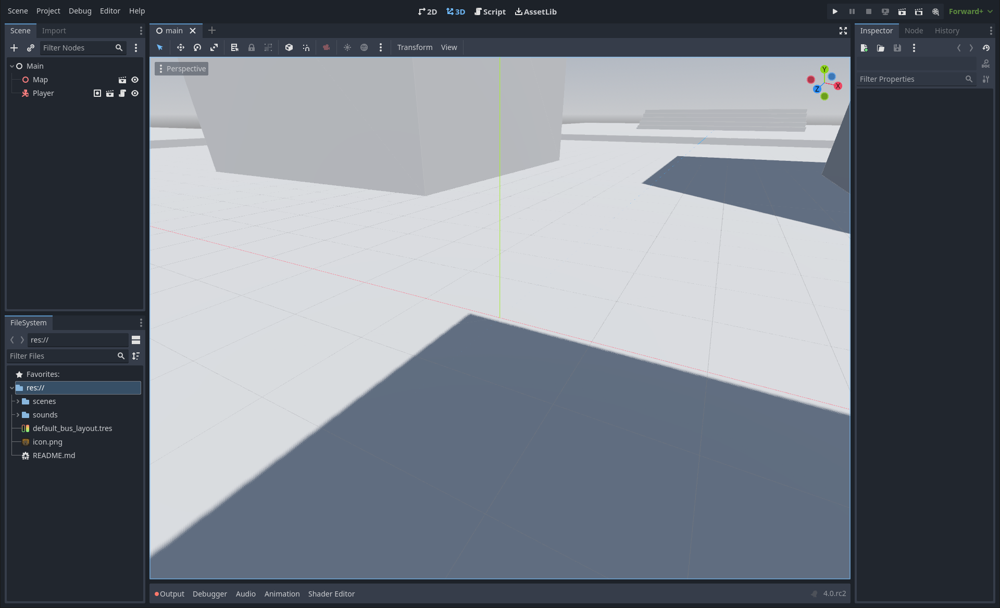

## Play und Stop

Das Schöne an einer Demo ist, dass du jetzt nicht mehr viel tun musst. Klicke einfach oben rechts auf den kleinen Play-Button und das Spiel sollte sich in einem extra Fenster starten und du kannst sofort losspielen.

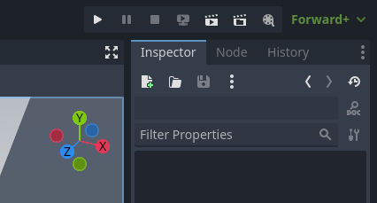

In der ausgewählten Demo kann man mit den Pfeiltasten herumlaufen, mit der Leertaste springen und mit STRG kannst du dich hinhocken.

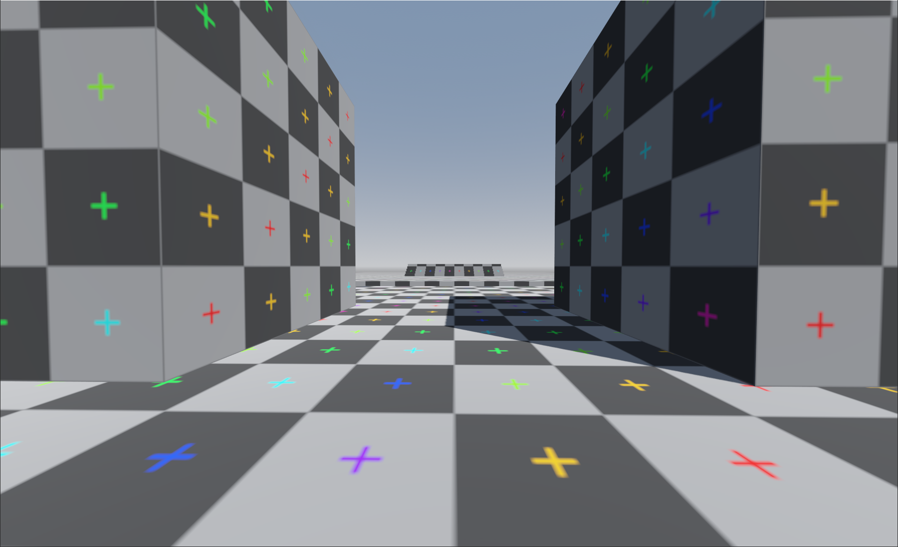

Die Demo lässt sich mit einem Klick auf das Schließen-Kreuz des Spielfensters oder durch den Stop-Button im Editor beenden.

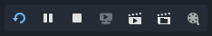

Und das war es schon. Damit hast du in kurzer Zeit deine erste Demo heruntergeladen, das Spiel gestartet und konntest testen, ob die Godot Engine bei dir grundsätzlich funktioniert.

Jetzt wird es aber Zeit für das erste eigene Projekt und die erste Zeile Code! Schließe dazu die Demo oben links im Menü mit einem Klick auf `Project` und dann `Quit to Project List`. Godot wird dich fragen, ob du das aktuelle Projekt wirklich schließen möchtest. Das kannst du mit `Yes` bestätigen - eventuell geänderte Szenen kannst du dabei gern speichern.

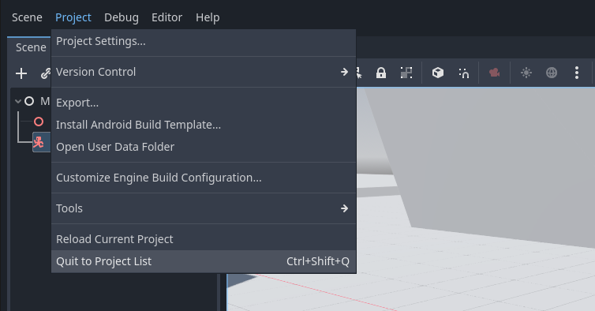