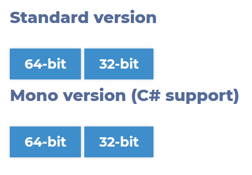

# Installation

Die Godot Engine kannst du auf allen gängigen Betriebssystemen (Linux, Windows, macOS) verwenden. Eine Installation oder Administratorrechte sind in der Regel nicht nötig. Für den Workshop nutzen wir die aktuelle Stable Version von Godot 3 - das ist zum Zeitpunkt der Chemniter Linux-Tage die Version 3.5.x.

!!! question "Moment mal - Aber es gibt doch schon Godot 4!? :thinking:"

    Ja, für Godot ist vor kurzem die Version 4 erschienen. Das ist die neuste Major-Version und bringt sehr viele Neuerungen - vom Vulkan-Renderer bis hin zu GDScript 2.0 - mit sich. Allerdings ist diese Version noch nicht wirklich stabil. Die Erfahrung mit Godot 3.0 hat gezeigt, dass die Engine mindestens ein bis zwei Minor-Versionen benötigt, damit alle krassen Bugs und Probleme behoben sind. Das liegt einfach daran, weil mit einer neuen Major-Version plötzlich sehr viel mehr Leute mit unterschiedlichster Hardware und Ideen im Kopf die Engine ausprobieren. Dabei fallen dann erst die vielen kleinen und großen Probleme auf, die vorher dem Entwicklerteam nicht in dem Maße bekannt waren.

    Grundsätzlich macht man nichts falsch, die Version 3.x weiterhin zu verwenden. Diese wird auch weiter von den Entwicklern gepflegt und bekommt Updates. Man muss auch nicht viel umlernen, wenn man später von Version 3 auf Version 4 wechselt. Der Code wird nahezu gleich aussehen und kann ein Godot-3-Projekt wird automatisch konvertiert, wenn man es mit Godot 4 öffnet. Dies hat damals beim Wechsel von Godot 2 auf Godot 3 auch schon gut geklappt.

## Herunterladen

Die [offizielle Downloadseite](https://godotengine.org/download) wählt automatisch für das Betriebssystem den passenden Download aus.

Eine Installation über einen Linux-Paketmanager, Snap oder Flatpack sollte auch funktioieren. Schau dir aber bitte die angebotene Version an, denn viele Pakete sind nicht gepflegt und dementsprechend veraltet. Eine Übersicht für verfügbare Linuxpakete findet sich bei [pkgs.org](https://pkgs.org/search/?q=godot).

## Varianten

Es gibt zwei Varianten (jeweils für 32- oder 64-bit Systeme):

Der Unterschied ist, dass die Mono-Variante zusätzlich die Programmiersprache C# unterstützt. Das benötigen wir für den Kurs nicht. Später kann man problemlos zur Mono-Version wechseln, wenn man das mal ausprobieren möchte.

Wenn du mit einem 32-bit Betriebssystem arbeitest, nimm die 32-bit Version. Ansonsten kannst du problemlos die 64-bit Version verwenden - einen Unterschied gibt es meines Wissens nach nicht.

## Exporttemplates

Falls du dein Spiel exportieren möchtest, um es danach mit anderen zu teilen, benötigst du die Exporttemplates.

Diese brauchen wir für den Workshop nicht. Sie lassen sich auch nachträglich problemlos im Godot Editor herunterladen und einrichten. Der Download könnte etwas länger dauern, da die Exporttemplates recht groß sind (> 500 MB).

## Webversion

Falls es für dein System keine aktuelle Godot-Version gibt oder sich das Programm nicht starten lässt, dann versuche es mal mit dem Web-Editor. Mit dem habe ich persönlich nur wenig Erfahrungen gemacht, er soll aber dieselben Funktionen unterstützen und eine Bearbeitung von Godot Projekten auch mobil ermöglichen.

Hier ist der Link: [https://editor.godotengine.org/](https://editor.godotengine.org/)